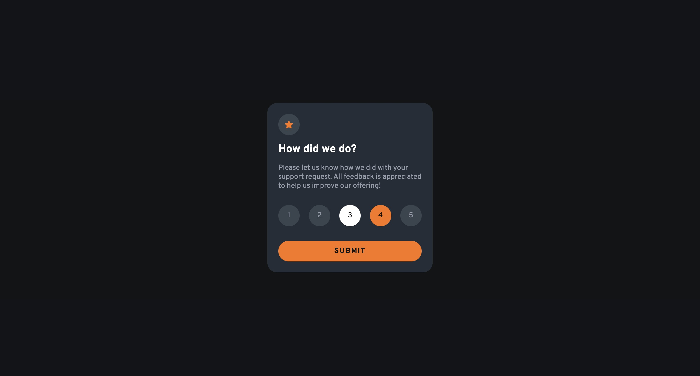

# Frontend Mentor - Interactive rating component solution

This is a solution to the [Interactive rating component challenge on Frontend Mentor](https://www.frontendmentor.io/challenges/interactive-rating-component-koxpeBUmI). Frontend Mentor challenges help you improve your coding skills by building realistic projects.

## Table of contents

-   [Overview](#overview)
    -   [The challenge](#the-challenge)
    -   [Screenshot](#screenshot)
    -   [Links](#links)
-   [My process](#my-process)
    -   [Built with](#built-with)
    -   [What I learned](#what-i-learned)
    -   [Continued development](#continued-development)

## Overview

### The challenge

Users should be able to:

-   View the optimal layout for the app depending on their device's screen size
-   See hover states for all interactive elements on the page
-   Select and submit a number rating
-   See the "Thank you" card state after submitting a rating

### Screenshot




### Links

-   Solution URL: [Add solution URL here](https://your-solution-url.com)
-   Live Site URL: [Add live site URL here](https://your-live-site-url.com)

## My process

### Built with

-   Semantic HTML5 markup
-   CSS custom properties
-   Flexbox
-   Mobile-first workflow

### What I learned

I learned how to improve accessibility by adding features such as aria-labels and roles.

```html
<li role="listitem">
    <button type="button" aria-label="Rate 1" class="rating-btn">1</button>
</li>
```

```html
<section
    id="thank-you-section"
    class="thank-you-section hidden"
    aria-live="polite"
></section>
```

### Continued development

As the reading materials mention, adding aria-labels is not a one-time coding practice. This is an ongoing practice, so I'll continue learning more about these attributes and other features to improve accessibility.
# interactive-rating-component-main
